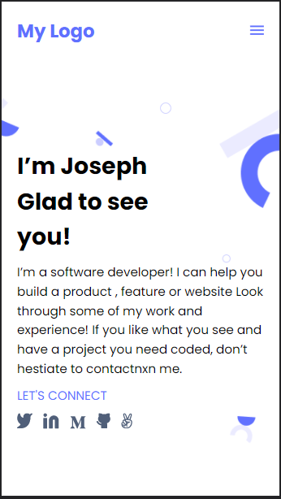

# Portofolio website

> Moving from Setting up a mobile version skeleton to a desktop version skeleton version of a Portofolio website with a refernce to a figma UI
> Adding some form validation tests to force the user to send consitent data

## Mobile Menu

## Form Validation

## Built With

- HTML and CSS
- npm, npx,Linters
- Javascript

## Live Domo

[Live demo](https://joseph07-drack.github.io/Portofolio/)

## Getting Started

To get a local copy up and running follow these simple example steps.

- Having the basics understanding of **HTML,CSS, Git, GitHub and GitHub Flow,Linters**

- Using the git command _git clone git@github.com:joseph07-drack/Portofolio.git_ to clone this project

- Changing the directory to **Hello-world** folder to get all files

- Running the _npm install_ to get all the modules from package.json

- Use _"npx hint ."_ and _"npx stylelint /\**/*.{css,scss}""_ to check for possible errors within the project

# Author

👤 **Buingo Joseph(JoDrack)**, **Thermiee Jolus**

- GitHub: [@joseph07-drack](https://github.com/joseph07-drack)
- LinkedIn: [Buingo Joseph(JoDrack)](https://www.linkedin.com/in/joseph-buingo-ab2682225/)

- GitHub: [Thermiee Jolus](https://github.com/Thermiee)

## 🤝 Contributing

Contributions, issues, and feature requests are welcome!

## Show your support

Give a ⭐️ if you like this project!

## Acknowledgments

- Microverseinc has inspired this project.

## 📝 License

This project is [MIT](./MIT.md) licensed.
